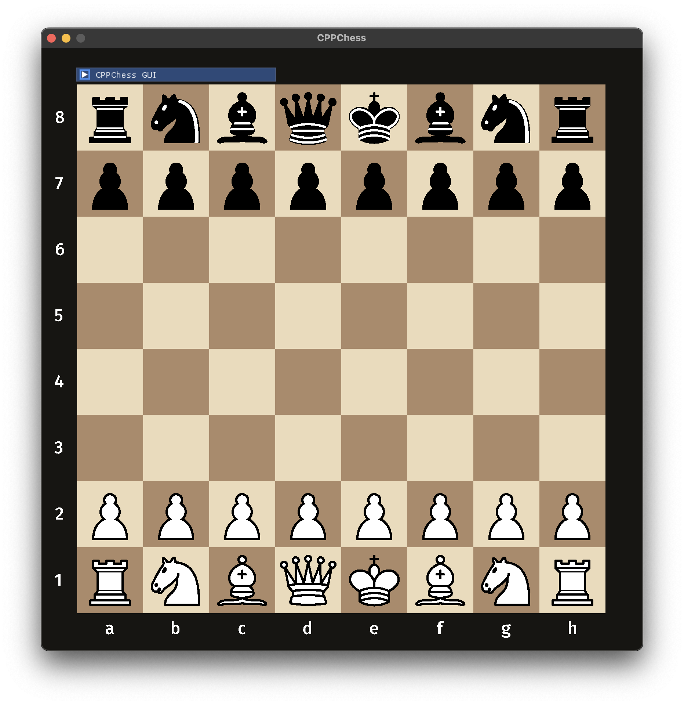

# Digital Chess Board with C++ and SDL2.0
CPPChess is a fully interactive two-player digital chess game developed in **C++** using the **SDL2** for graphics and **Dear ImGui** for the graphical user interface. Built as a final project for **Basics of Programming 2** at the [Budapest University of Technology and Economics](https://www.bme.hu/en), this application demonstrates learned object-oriented programming principles, with the addition of graphical development.

## Screenshots


## Features
- Almost full chess rules support: castling, en passant, check, checkmate, stalemate (draw by three fold repetition to be implemented)
- FEN parser: load and play custom positions
- PGN generator: export move history
- GUI with customization options: colors, animations, debug tools
- Drag & drop or click-based movement
- Clean OOP design and modular architecture

## Getting Started
### Requirements
- macOS with ARM architecture (tested on MacBook Pro M2)
- C++ compiler with C++17 support
- SDL2 libraries:
  - SDL2
  - SDL2_image
  - SDL2_ttf
  - SDL2_mixer

### Installing Dependencies (macOS)
Using **homebrew**
```bash
brew install sdl2 sdl2_image sdl2_ttf sdl2_mixer
```

### Installing & Running
``` bash
git clone --recurse-submodules https://github.com/DiegoGomesDG/CPPChess.git
cd CPPChess
make
./build/cppchess
```

## How to Play
1. Select a piece by clicking on it.
2. Move by either:
    - Clicking a destination square
    - Dragging and dropping
3. Flip the board by pressing F.
4. Access the menu for:
    - FEN loading
    - PGN export
    - Board settings & color customization

## Project Structure
```
cppchess/
├── assets/
│   ├── fonts/
│   ├── icon/
│   ├── original/
│   ├── pieces/
│   └── sounds/
├── build/               # Compiled binary
├── games/               # Exported PGN files
├── include/             # Header files
├── lib/                 # External libraries (includes Dear ImGui)
├── src/                 # Source files
├── README.md
└── CMakeLists.txt
```

## Third-Party Libraries and Licenses
This project uses the following open-source libraries:

**[SDL2](https://github.com/libsdl-org/SDL)**  
Cross-platform library for low-level access to audio, input, and graphics.  
Licensed under the [zlib License](https://github.com/libsdl-org/SDL/blob/main/LICENSE.txt)

**[SDL_image](https://github.com/libsdl-org/SDL_image)**  
Image loading extension for SDL2.  
Licensed under the [zlib License](https://github.com/libsdl-org/SDL_image/blob/main/LICENSE.txt)

**[SDL_ttf](https://github.com/libsdl-org/SDL_ttf)**  
TrueType font rendering for SDL2.  
Licensed under the [zlib License](https://github.com/libsdl-org/SDL_ttf/blob/main/LICENSE.txt)

**[SDL_mixer](https://github.com/libsdl-org/SDL_mixer)**  
Multi-channel audio mixer for SDL2.  
Licensed under the [zlib License](https://github.com/libsdl-org/SDL_mixer/blob/main/LICENSE.txt)

**[Dear ImGui](https://github.com/ocornut/imgui)**  
Immediate-mode GUI library for C++, included as a submodule in this project.  
Licensed under the [MIT License](https://github.com/ocornut/imgui/blob/main/LICENSE.txt)
